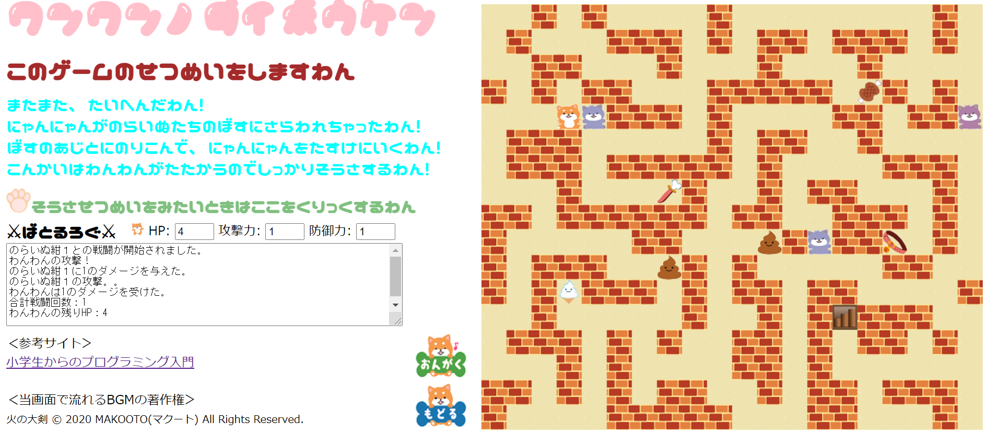
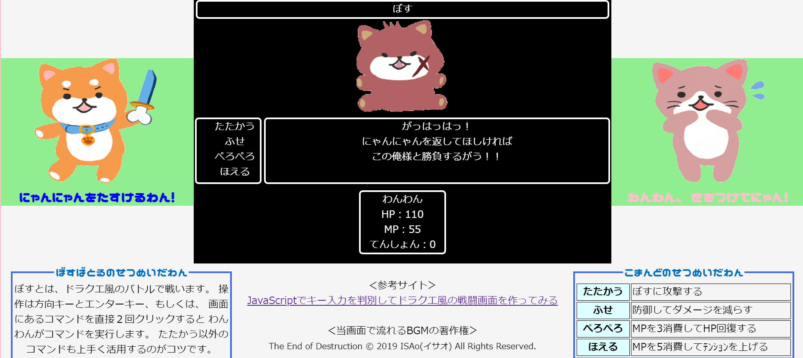
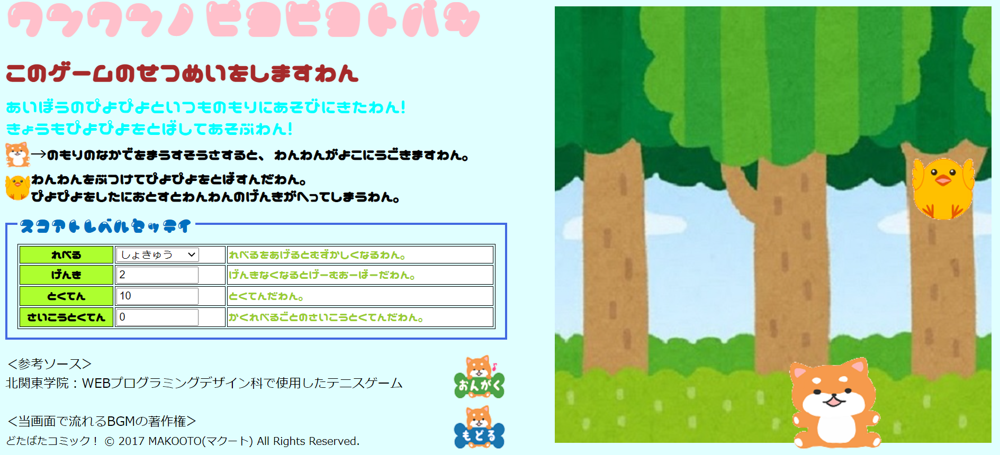

# wanwannogame
 
 田中がJavascriptとHTMLで作成したファミコン風のゲームを作品を複数掲載した作品です。  
 当作品に登場するキャラクター達は妻に描いてもらいました。
 
 # DEMO
 
 
 
 
 
 # Features
 
 わんわんのだいぼうけんというゲームは  
 不思議なダンジョンとドラクエ風バトルを混ぜ合わせた  
 製作時間70時間以上かけた大作になっていますので、是非、やってみて欲しいです。  
 また、 妻が描いてくれたキャラクター達が可愛いので是非、見てみてください。
 
 # Requirement
 
  jquery-3.5.1.min.js  
  canvas  
  ※canvasはJavascriptとHTML5に内蔵されています。  
  
  # Installation
  
  jquery-3.5.1.min.jsのダウンロードページ  
  https://jquery.com/download/
  
  # Usage
  
  推奨環境：PCのChromで画面フルサイズである。  
  また、HTML5が読み込めるブラウザであること。
  
  # Note
  
  当作品では各画面に音楽を流すことができるのですが  
  音楽を流す際は音量に気を付けてください。
  
  # Author
  
  creator	    ：タナカソルジャー  
  language	  ：Javascript,HTML5,CSS3  
  library	    ：Jquery,canvas  
  server	    ：firebase  
  illustrator	：妻  
  version	    ：1.0(初版)  
  
  # License
  
  当作品で使用するフリー素材の音源は下記のサイトよりダウンロードしており  
  音楽の著作権は下記のサイトの利用規約などに準ずる。  
  https://dova-s.jp/
  
